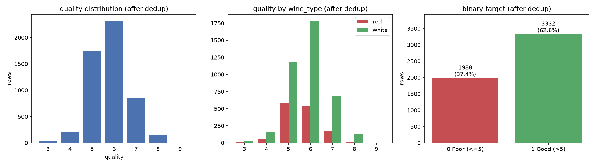
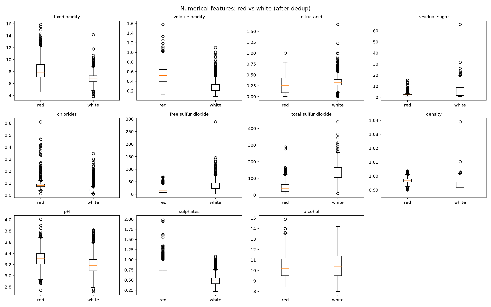
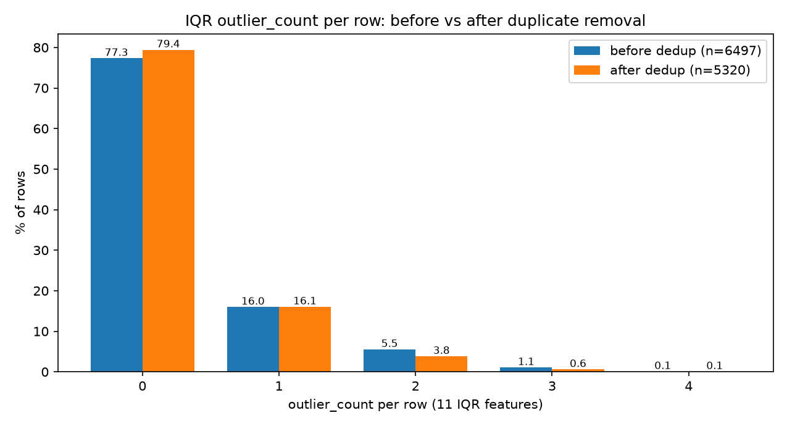
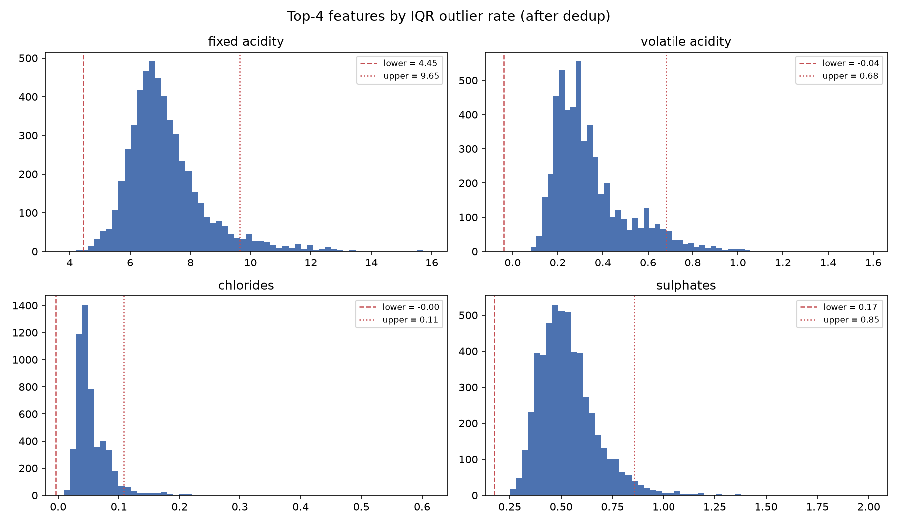
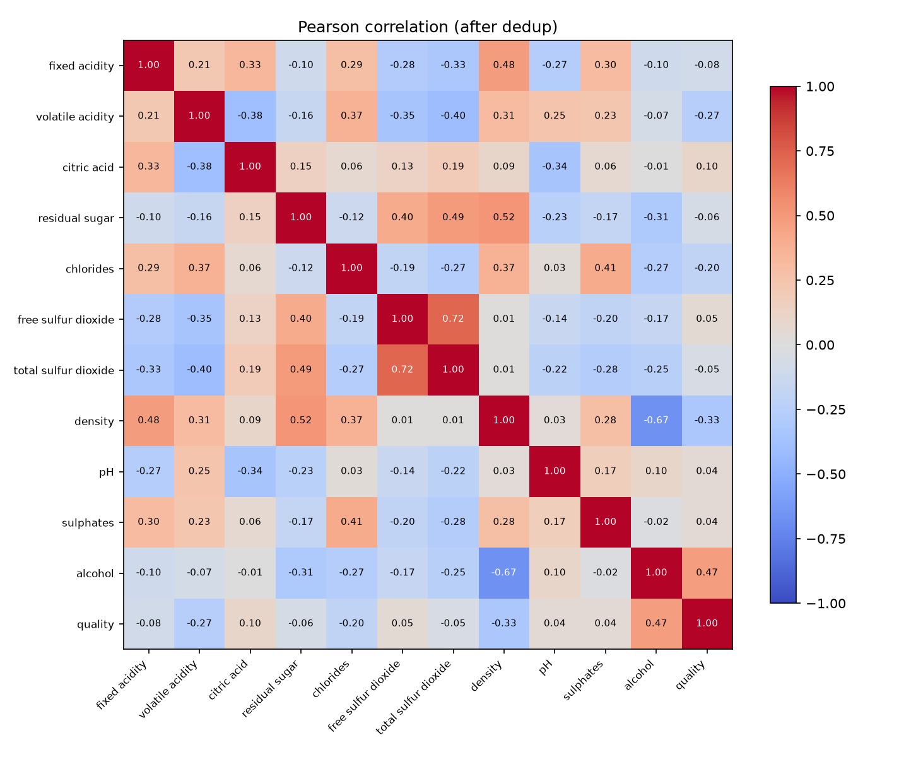

# Stage 1 — Data Engineering / EDA Report

**Project:** PMLDL Assignment 1 — Wine Quality Prediction MLOps Pipeline
**Scope:** Stage 1 only (data understanding + cleaning decisions). No model training.
**Data:** UCI Wine Quality (`data/raw/winequality-red.csv`, `data/raw/winequality-white.csv`)
**Reproduce:** `.venv/Scripts/python.exe code/datasets/explore.py` (console report) — figures below are saved to `notebooks/figures/`.
**Environment:** Python 3.13.5, pandas 3.0.5, numpy 2.5.3, matplotlib 3.11.2, scikit-learn 1.9.1.

---

## TL;DR — Stage 1 decisions

| # | Decision | Choice |
|---|----------|--------|
| 1 | Duplicates | **Remove exact duplicates** (all 13 columns) — 1177 rows → 5320 unique rows |
| 2 | Missing values | **None exist** (0 in every column) → deterministic assertion in `preprocess.py`, no imputation |
| 3 | Outlier detection | **IQR (1.5×IQR) on the 11 numeric features only** (quality, wine_type excluded) — used as *diagnostics*, not as a removal rule |
| 4 | Outlier removal | **Keep all outlier rows.** Wholesale IQR removal is rejected: −20.6% of data, red share drops 25.6%→16.7%, class balance shifts |
| 5 | Target | `target = 1 (Good) if quality > 5 else 0 (Poor)` — threshold **kept** (imbalance 1.68:1 is mild) |
| 6 | Categorical feature | `wine_type` (red/white) — one-hot encode, fit on train only |
| 7 | Numerical features | All 11 kept; no correlation-based removal (max pair |r| = 0.72); StandardScaler fit on train |
| 8 | Dataset size after cleaning | **5320 rows** (red 1359, white 3961) |
| 9 | Train/test split | **80/20 stratified** on binary target, `random_state=42` → 4256 / 1064 |
| 10 | Stage 2 | Implement `code/datasets/preprocess.py` per the spec at the end of this report |

---

## 1. Dataset integrity (Phase 1)

* Combined shape **(6497, 13)**: red 1599 + white 4898. Columns: 11 numeric (float64) + `wine_type` (str: red/white) + `quality` (int64: 3–9).
* **Missing values: 0 in every column** (both source files).
* Feature ranges (combined): fixed acidity 3.8–15.9, volatile acidity 0.08–1.58, citric acid 0.0–1.66, residual sugar 0.6–65.8, chlorides 0.009–0.611, free SO2 1–289, total SO2 6–440, density 0.9871–1.0390, pH 2.72–4.01, sulphates 0.22–2.0, alcohol 8.0–14.9.
* Sanity checks — **no physically impossible values**: no negative values; density within [0.98, 1.05]; pH within [2.5, 4.5]; alcohol within [8, 16] %vol; **free SO2 ≤ total SO2 in all 6497 rows**.
* Extreme values (sugar 65.8 g/L, total SO2 440 mg/L, citric acid 1.66) are unusual but chemically possible (sweet/high-SO2 white wines) → treated as **real observations, not errors**.

**Conclusion: raw data is structurally sound.** No repair needed; only duplicates require a decision.

## 2. Duplicates (Phase 2)

| Metric | Value |
|---|---|
| Exact duplicate rows (combined) | **1177 (18.12%)** |
| red duplicates | 240 (15.01% of 1599) → 1359 unique |
| white duplicates | 937 (19.13% of 4898) → 3961 unique |
| Rows after `drop_duplicates()` | **5320** (= 6497 − 1177, verified) |
| Feature-vector duplicates (quality excluded) | 2169 rows in 992 groups |
| Groups with **different** quality for identical features | **0 (no label contradictions)** |
| Feature+quality vector present in *both* wine types | 5 rows (kept: `wine_type` differs → valid distinct rows) |

Interpretation: duplicated rows are repeated lab records of the same measurement (rounded chemistry values collide naturally in wine labs). Since identical feature vectors **always** carry identical quality here, removing full duplicates is safe and removes no information — it only removes repeated weight of the same observation.

**Decision: REMOVE exact duplicates.** Additional leakage argument: keeping them would let identical rows land in both train and test, inflating test metrics.

## 3. Outlier analysis (Phases 3–5)

Method: IQR fences `Q1 − 1.5·IQR … Q3 + 1.5·IQR` per feature; **quality and wine_type excluded**; detection on the 11 numeric features only; run BEFORE and AFTER duplicate removal.

### 3.1 Before duplicate removal (n = 6497)

Feature-level (sorted by outlier rate):

| feature | lower | upper | n_out | out_% |
|---|---|---|---|---|
| citric acid | 0.040 | 0.600 | 509 | 7.83% |
| volatile acidity | −0.025 | 0.655 | 377 | 5.80% |
| fixed acidity | 4.450 | 9.650 | 357 | 5.50% |
| chlorides | −0.003 | 0.106 | 286 | 4.40% |
| sulphates | 0.175 | 0.855 | 191 | 2.94% |
| residual sugar | −7.650 | 17.550 | 118 | 1.82% |
| pH | 2.795 | 3.635 | 73 | 1.12% |
| free sulfur dioxide | −19.0 | 77.0 | 62 | 0.95% |
| total sulfur dioxide | −41.5 | 274.5 | 10 | 0.15% |
| density | 0.985 | 1.004 | 3 | 0.05% |
| alcohol | 6.800 | 14.000 | 3 | 0.05% |

Row-level `outlier_count` distribution:

| outlier_count | rows | % |
|---|---|---|
| 0 | 5024 | 77.33% |
| 1 | 1038 | 15.98% |
| 2 | 360 | 5.54% |
| 3 | 69 | 1.06% |
| 4 | 6 | 0.09% |

Cumulative: `≥ 2` → 435 (6.70%); `≥ 3` → 75 (1.15%); `≥ 4` → 6 (0.09%). Total flagged: **1473 (22.67%)** — matches the earlier estimate.

**Key insight:** of the 1473 flagged rows, **70% (1038) are outliers on exactly ONE feature**; only 6.7% on 2+ and 1.15% on 3+ features. The headline "22.7% problematic" is misleading — most flagged rows are ordinary wines extreme in a single narrow-scale feature (e.g., citric acid, whose IQR is only 0.14). Single-feature outlier rows are led by citric acid (259), fixed acidity (195), volatile acidity (180), chlorides (125).

### 3.2 After duplicate removal (n = 5320)

| feature | lower | upper | n_out | out_% |
|---|---|---|---|---|
| fixed acidity | 4.450 | 9.650 | 304 | 5.71% |
| volatile acidity | −0.040 | 0.680 | 279 | 5.24% |
| chlorides | −0.004 | 0.108 | 237 | 4.46% |
| sulphates | 0.175 | 0.855 | 163 | 3.06% |
| citric acid | −0.000 | 0.640 | 143 | 2.69% |
| residual sugar | −6.750 | 16.050 | 141 | 2.65% |
| pH | 2.780 | 3.660 | 49 | 0.92% |
| free sulfur dioxide | −21.5 | 78.5 | 44 | 0.83% |
| total sulfur dioxide | −44.9 | 272.1 | 10 | 0.19% |
| density | 0.985 | 1.004 | 3 | 0.06% |
| alcohol | 6.650 | 14.250 | 1 | 0.02% |

Row-level: 0 → 4226 (79.44%); 1 → 854 (16.05%); 2 → 204 (3.83%); 3 → 32 (0.60%); 4 → 4 (0.08%).
Cumulative: `≥ 2` → 240 (4.51%); `≥ 3` → 36 (0.68%); `≥ 4` → 4 (0.08%). Total flagged: **1094 (20.56%)**.

Effect of dedup on outliers:
* absolute flagged rows fall 1473 → 1094 (379 flagged rows were duplicates — mostly citric-acid outliers: 509 → 143);
* the flagged **share** barely moves (22.67% → 20.56%);
* **the bounds themselves shift** (residual sugar upper 17.55 → 16.05; volatile acidity lower −0.025 → −0.040; citric acid upper 0.600 → 0.640). IQR fences are estimated from the very data they are applied to — the quantitative justification for the leakage rule in §6.

### 3.3 Are the outliers errors or real wines?

* All values are physically possible (§1); extremes match plausible wine profiles (sweet white wines: sugar up to 65.8 g/L; high-SO2 whites: 440 mg/L total).
* Outlier rows carry **signal, not noise**: Good share among them is **50.8% vs 65.7%** for clean rows — they are disproportionately lower-quality wines; deleting them deletes "Poor"-side information and biases the model toward Good.
* Outliers are dominated by red wines: 59.9% of flagged rows vs 25.6% red share overall — pooled fences over-flag reds because red chemistry genuinely differs (see §3.4).

### 3.4 Supplement: pooled vs per-wine-type fences (after dedup)

| wine type | flagged by pooled bounds | flagged by own-type bounds |
|---|---|---|
| red (n=1359) | 655 (**48.20%**) | 340 (25.02%) |
| white (n=3961) | 439 (11.08%) | 706 (17.82%) |

Pooled fences flag almost **half of all reds** (fixed/volatile acidity: +234 flags each; red own upper bound for fixed acidity is 12.35 vs pooled 9.65) while **under-flagging whites** (residual sugar: pooled bound adds 125 extra white flags; citric acid pooled [0.00, 0.64] vs white own [0.09, 0.57]).

Conclusion: pooled IQR is a blunt instrument on a bimodal (red/white) population. This further discredits "delete IQR outliers" as a cleaning rule — and justifies keeping `wine_type` as a model feature so the model learns the two chemistry regimes.

### 3.5 Outlier strategy decision (Phase 9 trade-offs)

Impact on the cleaned dataset (baseline: n=5320, Good 62.63%, red 25.55%):

| strategy | rows kept | dropped | Good % | red % |
|---|---|---|---|---|
| keep all (no removal) | 5320 (100.00%) | 0 | 62.63% | 25.55% |
| drop outlier_count ≥ 4 | 5316 (99.92%) | 4 | 62.66% | 25.49% |
| drop outlier_count ≥ 3 | 5284 (99.32%) | 36 | 62.74% | 25.08% |
| drop outlier_count ≥ 2 | 5080 (95.49%) | 240 | 63.03% | 23.07% |
| drop all IQR outliers | 4226 (79.44%) | 1094 | 65.69% | **16.66%** |

* **drop all** — loses 20.6% of data, collapses red share 25.6% → 16.7% (red loses ~48% of its rows: 655 of 1359), shifts classes toward Good (+3.1 pp). The model would train on a biased population, and the deployed API would receive red-wine chemistry never seen in training. **Rejected.**
* **drop ≥ 2** — discards 240 real wines for an unproven benefit; adds a hard-to-justify rule. **Rejected.**
* **drop ≥ 3 / ≥ 4** — cheap (36 / 4 rows) but arbitrary; those rows are plausible rare wines, not errors. **Rejected as default.**
* **winsorize / clip** — distorts real measurements, must be reproduced at serving time, unnecessary for tree models. **Rejected.**
* **keep all** — zero data loss, no serving-time surprises, robustness delegated to the model family. **Selected.**

**Decision: KEEP ALL OUTLIER ROWS.** IQR analysis remains in the pipeline as a *logged diagnostic* (also useful later for data-drift monitoring), not as a filter. Documented fallback (only if Stage 3 experiments show training instability): drop rows with `outlier_count ≥ 3` (36 rows, 0.68%) using bounds fitted on the training fold only.






## 4. Target analysis (Phase 7)

quality distribution (cleaned, n=5320): 3 → 30 (0.56%); 4 → 206 (3.87%); 5 → 1752 (32.93%); 6 → 2323 (43.67%); 7 → 856 (16.09%); 8 → 148 (2.78%); 9 → 5 (0.09%).

Binary target `quality <= 5 → 0 Poor | quality > 5 → 1 Good`:

| class | rows | % |
|---|---|---|
| 0 Poor | 1988 | 37.37% |
| 1 Good | 3332 | 62.63% |

Imbalance ratio Good : Poor = **1.68 : 1** — mild.

Threshold check: the median quality is 6, so the 5/6 cut is a near-median split (37/63). Alternative cuts are strictly worse: `quality <= 4` → 95.6/4.4 (degenerate), `quality <= 6` → 81.0/19.0. The tiny classes quality=3 and quality=9 (35 rows, 0.66% combined) have no material effect on binary labels. **No statistical or data-quality reason to change the threshold — keep `quality > 5`.**

wine_type × target (within type): red → **52.91% Good** (719/1359); white → **65.97% Good** (2613/3961). A 13 pp gap means `wine_type` carries real predictive signal and **must remain a feature**; in Stage 3, metrics should also be reported per wine type.

## 5. Correlations & skewness (Phase 8)

Strongest pairs (cleaned, Pearson): free SO2 × total SO2 **0.720**; density × alcohol **−0.668**; residual sugar × density 0.521; residual sugar × total SO2 0.488; fixed acidity × density 0.478; alcohol × quality 0.469; chlorides × sulphates 0.405; volatile acidity × total SO2 −0.401.

* No pair exceeds |r| = 0.8 → **no feature removal**; the strongest pairs reflect real wine chemistry (SO2 dosage vs acidity; density vs sugar/alcohol).
* |corr| with quality: alcohol 0.469 > density 0.326 > volatile acidity 0.265 > chlorides 0.202; the rest < 0.1 — consistent with known UCI wine-quality findings (alcohol is the dominant single predictor).
* Skewness: chlorides **5.34**, sulphates 1.81, residual sugar 1.71, fixed acidity 1.65, volatile acidity 1.50, free SO2 1.36; density/alcohol/pH ≈ symmetric.
* Transformation implications: the planned model family is tree-based → **no log/power transforms in Stage 2**. If a linear model family is adopted in Stage 3, revisit `log1p` for the six right-skewed features (decision fitted on train only). StandardScaler (fit on train) is kept in the plan for serving consistency and future model families.


## 6. Data leakage rules (Phase 10)

Safe **BEFORE** the split (no parameters estimated from data):
* load red/white, merge, add `wine_type`;
* deterministic sanity checks (missing values, impossible values, free SO2 ≤ total SO2);
* **remove exact duplicates — must happen BEFORE the split**: otherwise identical rows leak across train and test and inflate test metrics;
* create the binary target (fixed threshold rule, no data statistics involved).

**AFTER** the split, fit on train only:
* scaling statistics (StandardScaler);
* categorical encoding (fit encoder on train, `handle_unknown='ignore'`);
* imputation statistics — N/A (no missing values);
* outlier thresholds — **not used at all in v1** (decision §3.5). If the fallback outlier rule is ever activated, its IQR bounds must be computed on the training fold only and applied for removal on train; test rows are never dropped (they are only scored by the model). Rationale: bounds computed on the full dataset would leak test-distribution information into preprocessing — §3.2 showed the bounds are sample-sensitive (residual sugar upper bound 17.55 vs 16.05).

## 7. STAGE 1 FINAL DECISIONS

1. **Duplicate strategy:** drop exact duplicates across all 13 columns of the combined frame, BEFORE train/test split. Verified: 0 label contradictions among 992 feature-duplicate groups; 6497 → 5320 rows (red 1359, white 3961).
2. **Missing-value strategy:** no missing values exist (0 in every column of both sources); `preprocess.py` enforces this with a hard fail-fast check instead of imputation.
3. **Outlier detection strategy:** univariate IQR fences (1.5×IQR) on the 11 numeric features only; quality and wine_type excluded; pooled red+white bounds; used for diagnostics/monitoring, NOT for filtering.
4. **Outlier removal strategy:** keep all rows (0 rows removed). Justified by §3.3–§3.5 (physically plausible extremes; informative target mix; −20.6% data and −9 pp red share if removed; tree models robust to outliers). Documented fallback: remove `outlier_count ≥ 3` (36 rows) with train-fitted bounds, only if Stage 3 shows instability.
5. **Target definition:** `target = 1 (Good) if quality > 5 else 0 (Poor)`; threshold kept (near-median split, 1.68:1 imbalance handled by stratified split + class weighting / balanced metrics); `quality` is NOT a model feature.
6. **Categorical features:** `wine_type` — one-hot encoded, encoder fit on train only, `handle_unknown='ignore'`.
7. **Numerical features:** all 11 original features kept; no correlation-based removal (max pair |r| = 0.72); no monotone transforms in v1; StandardScaler fit on train only.
8. **Expected dataset size after cleaning:** 5320 rows × (11 numeric + wine_type + quality + target).
9. **Expected train/test split:** 80/20, stratified by binary target, `random_state = 42` → train 4256 (~37.4% Poor / 62.6% Good), test 1064.
10. **Preprocessing implemented in Stage 2:** see the specification below.

## 8. Stage 2 specification — `code/datasets/preprocess.py`

```text
load raw red/white csv (sep=';')
→ add wine_type ('red' / 'white'), concat                      → 6497 × 13
→ deterministic checks: no NaN, no impossible values (assert/log)
→ drop exact duplicates (all 13 cols)                          → 5320 × 13
→ define target: quality → target (0 if <= 5 else 1); quality excluded from X
→ X = 11 numeric features + wine_type;  y = target
→ train_test_split(test_size=0.2, random_state=42, stratify=y) → 4256 / 1064
→ fit preprocessing on TRAIN only:
     - OneHotEncoder(wine_type, handle_unknown='ignore')
     - StandardScaler(numeric)            [no outlier ops, no imputation]
→ transform train / test  (sklearn ColumnTransformer / Pipeline)
→ save data/processed/train.csv + test.csv (+ fitted transformer artifact for serving)
→ log shapes, class balance, and a deterministic fingerprint of outputs
```

Implementation requirements: fully deterministic for fixed inputs (fixed `random_state`); no leakage (everything data-driven is fit on train only); explicit constants at module top (threshold 5, test_size, random_state, paths); pure, unit-testable functions (load → clean → build_target → split → transform); log every step.

## 9. Stage 1 completion criteria

- [x] raw data verified
- [x] red + white combined (6497 rows)
- [x] wine_type added
- [x] duplicates analysed (1177 exact; 0 label contradictions)
- [x] duplicate strategy decided (remove)
- [x] missing values analysed (0)
- [x] numerical features identified (11)
- [x] quality excluded from feature outlier detection
- [x] IQR bounds calculated (before & after dedup)
- [x] outlier counts calculated
- [x] row-level outlier_count calculated
- [x] outlier_count distribution analysed (77.3 / 16.0 / 5.5 / 1.1 / 0.1 % before dedup)
- [x] outlier strategy decided (keep all; documented fallback)
- [x] target analysed
- [x] class balance analysed (37.4% Poor / 62.6% Good)
- [x] wine_type relationship analysed (52.9% vs 66.0% Good)
- [x] correlations inspected (max pair |r| = 0.72)
- [x] leakage risks identified (dedup before split; fit-on-train rules)
- [x] final preprocessing plan documented

---

**STAGE 1 STATUS: READY**

No blocking questions remain for Stage 2. Optional, non-blocking follow-ups: per-wine-type metric reporting and model comparison in Stage 3; per-type IQR bounds for drift monitoring; `log1p` transforms only if a linear model family is adopted.

---

## Appendix — artifacts

* Reproducible analysis script: `code/datasets/explore.py`
* Interactive exploration notebook: `notebooks/data_exploration.ipynb`
* Figures: `notebooks/figures/fig1_target_distribution.png` … `fig5_correlation_heatmap.png`